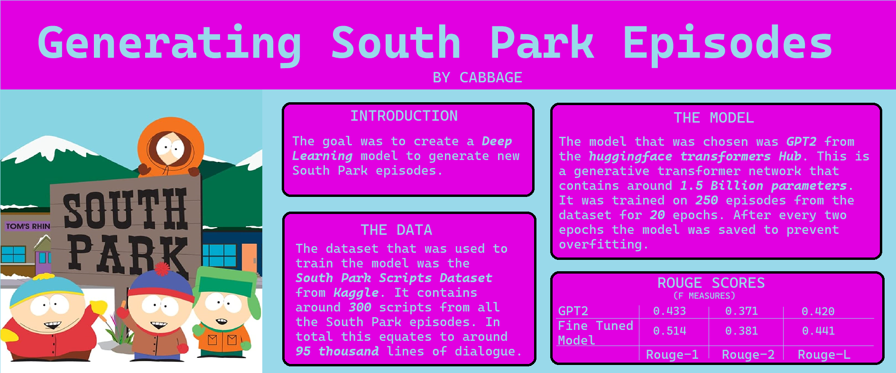

# Generating South Park Episodes

	

---

## Summary

I've fine-tuned the [GPT2](https://huggingface.co/gpt2) model on South Park episodes. The library that was used to train the model was the [**huggingface transformers**](https://huggingface.co/) library and the dataset was gathered from this [Kaggle dataset](https://www.kaggle.com/datasets/mustafacicek/south-park-scripts-dataset).

---

## Modules

The Repo contains 4 modules:

- [Data Preporcessing](./DataPreprocessing/csv_to_dict.ipynb): Contains the code that preprocesses the dataset and creates the `SouthPark_Data_test.pkl` and `SouthPark_Data_train.pkl` files.
- [Train](./AI/train.py): This module contains the code that trains the model.
- [Testing](./AI/test.py): Computes the Rouge-1, Rouge-2, and Rouge-L scores for the test set.
- [Inference](./AI/inference.py): This module is used to generate episodes.

---

## Poster

